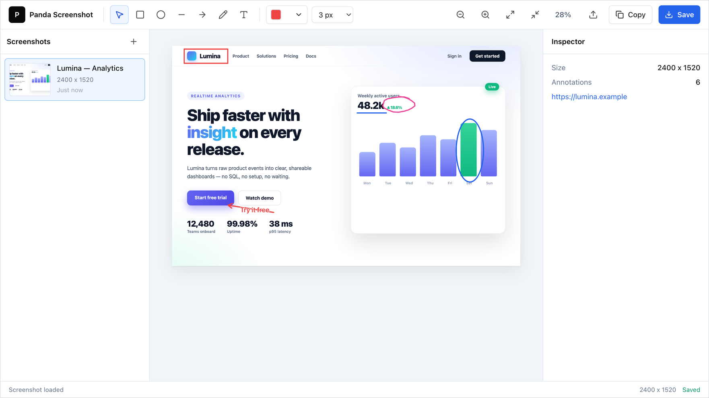

# Panda Screenshot

Panda Screenshot is a local screenshot capture and annotation app. It ships as a single self-contained binary — the server, web app, and Chrome extension are all bundled in.



## Install

**macOS / Linux**

```bash
curl -fsSL https://raw.githubusercontent.com/ralphite/panda/main/install.sh | sh
```

**Windows** (PowerShell)

```powershell
irm https://raw.githubusercontent.com/ralphite/panda/main/install.ps1 | iex
```

The installer asks where to keep data (default `~/.panda`, or `%LocalAppData%\Panda` on Windows), puts a `panda` command on your PATH, writes the Chrome extension into `<data>/extension`, optionally enables auto-start (launch at login + restart on crash), then runs Panda in the background and opens http://localhost:8088/screenshot.

Run `panda` any time to start it again.

## Chrome Extension

1. Open `chrome://extensions`.
2. Enable Developer Mode.
3. Load unpacked from the `extension` folder in your data directory (the installer prints the path), or from `extension/` in this repo when developing.
4. Keep Panda running on `http://localhost:8088`.
5. Click the extension icon on any normal page. It captures the visible viewport, opens a crop tab before the source tab, uploads the crop, then replaces that tab with the web editor.
6. Press `Ctrl+Shift+P` to trigger the same visible viewport capture from the keyboard.
7. Right click the extension icon and choose `Full-page Screenshot` when you need the old full-page capture flow.

Temporary captures live in Chrome extension IndexedDB. They are removed after upload, when the crop tab is closed, and after 30 minutes.

## Keyboard

- `V` select
- `R` rectangle
- `O` oval
- `L` line
- `A` arrow
- `P` pencil
- `T` text
- `Enter` insert a newline while typing text
- `Esc` finish typing text
- `Delete` remove selection
- `C` copy annotated image

## Develop

```bash
npm --prefix web install
npm --prefix web run build
go run ./cmd/panda
```

Open http://localhost:8088/screenshot. The frontend must be built before the Go binary, since it is embedded at compile time.

Other targets: `make build` (single binary), `make test` (web + Go tests), `make release` (cross-compile every platform into `dist/`).

Flags: `-data <dir>` overrides the data folder; `-web <dir>` serves the frontend from disk instead of the embedded build, for live frontend work.
